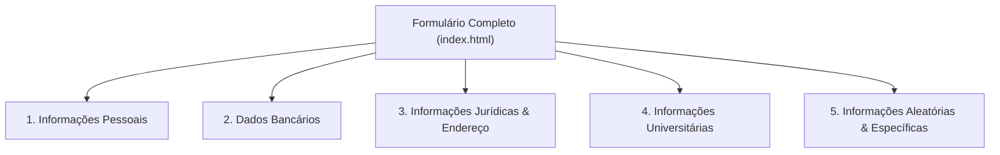

# Tasks - Aula 01 | Formulário Avançado com Validações Regex

Projeto desenvolvido como parte das atividades práticas da disciplina **Programação III** (Prática de Linguagem de Programação).

Esta atividade prática aprofunda o uso de **Expressões Regulares (RegEx)** no atributo `pattern` de formulários HTML5, aplicando regras de validação rigorosas para diversos formatos de dados reais do cotidiano profissional, bancário, acadêmico e geográfico.

---

## 📋 Estrutura da Atividade ([`index.html`](./index.html))

O formulário é estruturado e segmentado em 5 conjuntos de campos semânticos (`<fieldset>`), onde todos os campos são de preenchimento obrigatório (`required`):



---

## 🔍 Detalhamento das Expressões Regulares por Seção

### 1. 👤 Informações Pessoais

* **Nome Completo (`fullname`):**
  * **Pattern:** `^[A-Za-zÀ-ÿ]+(\s[A-Za-zÀ-ÿ]+)+$`
  * **Placeholder:** `Marlon da Silva`
  * **Explicação:** Exige no mínimo duas palavras (nome e sobrenome). O primeiro termo `[A-Za-zÀ-ÿ]+` aceita letras maiúsculas, minúsculas e caracteres com acentuação gráfica da língua portuguesa; em seguida, `(\s[A-Za-zÀ-ÿ]+)+` exige um ou mais sobrenomes antecedidos por um espaço em branco.

* **Telefone (`telefone`):**
  * **Pattern:** `\(\d{2}\)\s\d{4,5}-\d{4}`
  * **Placeholder:** `(99) 99999-9999`
  * **Explicação:** Exige o DDD de 2 dígitos entre parênteses `\(\d{2}\)`, seguido de um espaço `\s`, de 4 a 5 dígitos `\d{4,5}` (abrangendo telefones fixos ou celulares com 9 dígitos), hífen `-` e 4 dígitos finais `\d{4}`.

* **Data de Nascimento (`birthdate`):**
  * **Pattern:** `(0[1-9]|[12][0-9]|3[01])\/(0[1-9]|1[0-2])\/\d{4}`
  * **Placeholder:** `09/12/2022`
  * **Explicação:** Valida o formato `DD/MM/AAAA` com limites de calendário:
    * `(0[1-9]|[12][0-9]|3[01])`: Dias válidos de `01` a `31`.
    * `\/`: Barra separadora.
    * `(0[1-9]|1[0-2])`: Meses válidos de `01` a `12`.
    * `\/`: Barra separadora.
    * `\d{4}`: Ano composto por exatamente 4 dígitos numéricos.

* **CPF (`cpf`):**
  * **Pattern:** `\d{3}\.\d{3}\.\d{3}-\d{2}`
  * **Placeholder:** `123.456.789-12`
  * **Explicação:** Valida o formato pontuado padrão do CPF brasileiro com 3 blocos de 3 dígitos separados por pontos literais escapados (`\.`), seguidos por hífen `-` e 2 dígitos verificadores (`\d{2}`).

* **RG (`rg`):**
  * **Pattern:** `\d{1,2}\.\d{3}\.\d{3}`
  * **Placeholder:** `1.234.567`
  * **Explicação:** Aceita RGs formatados com 1 ou 2 dígitos no primeiro bloco `\d{1,2}`, seguido por dois blocos de 3 dígitos com separadores de ponto (ex.: `1.234.567` ou `12.345.678`).

* **Tipo Sanguíneo (`blood-type`):**
  * **Pattern:** `(A|B|AB|O)[+-]`
  * **Placeholder:** `A+`
  * **Explicação:** Aceita apenas os tipos sanguíneos válidos no sistema ABO `(A|B|AB|O)` seguidos obrigatoriamente do sinal positivo ou negativo do fator Rh `[+-]`.

* **Email Pessoal (`personal-email`):**
  * **Pattern:** `[a-zA-Z0-9._%+-]+@[a-zA-Z0-9.-]+\.[a-zA-Z]{2,}`
  * **Placeholder:** `you@mail.com`
  * **Explicação:** Validação de email padrão: usuário com caracteres alfanuméricos e símbolos permitidos, `@`, provedor e domínio superior (TLD) com pelo menos 2 caracteres alfabéticos.

---

### 2. 💳 Dados Bancários

* **Número do Cartão (`credit-card`):**
  * **Pattern:** `\d{4}\s\d{4}\s\d{4}\s\d{4}`
  * **Placeholder:** `1234 5678 1234 5678`
  * **Explicação:** Valida o formato típico de exibição de cartão de crédito de 16 dígitos dispostos em 4 blocos de 4 dígitos separados por espaço.

* **Validade do Cartão (`validade`):**
  * **Pattern:** `(0[1-9]|1[0-2])\/\d{2}`
  * **Placeholder:** `12/26`
  * **Explicação:** Formato `MM/AA`, assegurando que o mês esteja no intervalo válido de `01` a `12` (`(0[1-9]|1[0-2])`), seguido de barra literal e 2 dígitos para o ano.

* **Código de Segurança (`cvv`):**
  * **Pattern:** `\d{3,4}`
  * **Placeholder:** `123`
  * **Explicação:** Aceita 3 dígitos (padrão Visa/Mastercard) ou 4 dígitos (padrão American Express).

---

### 3. ⚖️ Informações Jurídicas e Endereço

* **CNPJ (`cnpj`):**
  * **Pattern:** `\d{2}\.\d{3}\.\d{3}\/\d{4}-\d{2}`
  * **Placeholder:** `00.000.000/0001-00`
  * **Explicação:** Formato canônico de CNPJ (`XX.XXX.XXX/XXXX-XX`) com pontos, barra e hífen devidamente delimitados.

* **Inscrição Estadual (`ie`):**
  * **Pattern:** `(\d{2,3}\.?\d{3}\.?\d{3}\.?\d{1,3}|\d{8,14})`
  * **Placeholder:** `123.456.789.123`
  * **Explicação:** Suporta formatos de Inscrição Estadual com pontos opcionais (`\.?`) ou sequências puramente numéricas entre 8 e 14 dígitos, cobrindo variações de regras estaduais brasileiras.

* **CEP (`cep`):**
  * **Pattern:** `\d{5}-\d{3}`
  * **Placeholder:** `88130-000`
  * **Explicação:** Formato padrão dos Correios: 5 dígitos numéricos, hífen literal e 3 dígitos de terminação.

* **Endereço (`adress`):**
  * **Pattern:** `.{5,}`
  * **Placeholder:** `Rua dos Bobos, Nº 0`
  * **Explicação:** Qualquer caractere com comprimento mínimo de 5 caracteres, garantindo uma descrição minimamente plausível de logradouro.

---

### 4. 🎓 Informações Universitárias

* **Matrícula (`matricula`):**
  * **Pattern:** `\d{6,12}`
  * **Placeholder:** `2026100123`
  * **Explicação:** Aceita sequências numéricas de 6 a 12 dígitos, condizente com identificadores de registro acadêmico universitário.

* **Email Institucional FMP (`fmp-email`):**
  * **Pattern:** `[a-zA-Z0-9._%+-]+@aluno\.fmpsc\.edu\.br`
  * **Placeholder:** `nome@aluno.fmpsc.edu.br`
  * **Explicação:** Restringe o preenchimento exclusivamente ao domínio institucional de discentes da **Faculdade Municipal de Palhoça** (`@aluno.fmpsc.edu.br`).

---

### 5. 🌐 Informações Específicas e Dados Diversos

* **Latitude (`lagitude`):**
  * **Pattern:** `-?([1-8]?\d(\.\d+)?|90(\.0+)?)`
  * **Placeholder:** `-27.6432`
  * **Explicação:** Valida coordenadas geográficas de latitude no intervalo de -90.0° a +90.0° com casas decimais opcionais.

* **Longitude (`longitude`):**
  * **Pattern:** `-?(180(\.0+)?|(1[0-7]\d|\d{1,2})(\.\d+)?`
  * **Placeholder:** `-48.6712`
  * **Explicação:** Valida coordenadas de longitude no intervalo angular de -180.0° a +180.0°.

* **Código de Barras FEBRABAN (`codebar`):**
  * **Pattern:** `\d{44}`
  * **Placeholder:** `44 dígitos numéricos`
  * **Explicação:** Exige exatamente 44 dígitos contínuos, formato oficial de linha digitável/código de barras de boletos bancários da Federação Brasileira de Bancos.

* **Placa de Veículo - Mercosul (`idcar`):**
  * **Pattern:** `[A-Z]{3}[0-9][A-Z][0-9]{2}`
  * **Placeholder:** `ABC1D23`
  * **Explicação:** Padrão automotivo de placas do Mercosul adotado no Brasil: 3 letras maiúsculas, 1 dígito numérico, 1 letra maiúscula e 2 dígitos numéricos.

* **Lote de Venda (`lote`):**
  * **Pattern:** `[A-Z]{2,4}-\d{4,6}`
  * **Placeholder:** `LT-202601`
  * **Explicação:** Código de rastreamento com 2 a 4 letras em maiúsculo, hífen e de 4 a 6 dígitos numéricos.

---

## 🛠️ Tecnologias Utilizadas

- **HTML5:**
  - Validação nativa com a Constraint Validation API.
  - Atributos semânticos `required`, `pattern`, `placeholder`, `type`.
  - Agrupamento com `<fieldset>` e identificação com `<legend>` e `<label>`.
- **Expressões Regulares (RegEx):** Padrões avançados com classes de caracteres, quantificadores, agrupamentos e alternâncias lógicas.

---

## 🚀 Como Executar e Testar

1. Navegue até a pasta `Tasks`:
   ```bash
   cd "Programação III/Aula 01/Tasks"
   ```
2. Abra o arquivo [`index.html`](./index.html) no navegador (duplo clique ou via extensão como Live Server).
3. Teste os dados preenchendo o formulário com dados válidos e simulando valores inválidos (por exemplo, nome sem sobrenome, email fora do domínio FMP ou placas fora do formato Mercosul) para verificar o bloqueio de submissão do HTML5.
